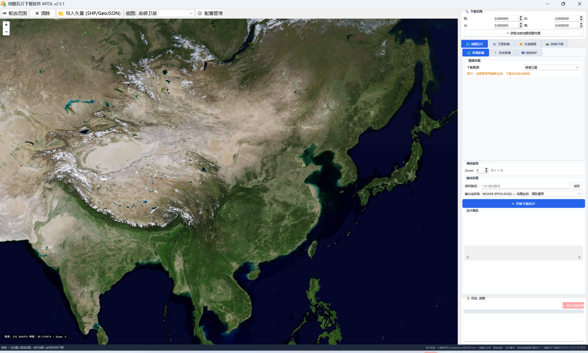

# Map Tile Downloader · MTDL


**English | [简体中文](README_ZH.md)**

**Map Tile Downloader (MTDL)** is a Windows desktop tool for surveying, remote sensing and GIS data preparation. It integrates **multi-source online basemap tiles, historical imagery, satellite imagery, vector data, land-cover products, elevation data and local time-series imagery processing** in one workspace. The goal is to reduce repetitive configuration and fragmented workflows when searching, downloading, mosaicking, exporting and preparing geospatial data.

> **MTDL requires registration and activation before normal use.** Software activation applies only to the MTDL application itself and does not grant any rights to third-party maps, imagery, vector data, DEM products or online services.

> **[Download MTDL v2.5.1 for Windows — ZIP](https://github.com/zhangyhrs/map_tile_downloader/releases/download/map_tile_downloader_v2_5_1/MTDL_v2.5.1.zip)**
>
> Extract the complete ZIP and run the included executable. GitHub's **Source code** archives and **Code → Download ZIP** are not the application package.

## Interface



## What MTDL is

MTDL is fundamentally a **geospatial data access and processing client**. It accesses external data through public interfaces, user-configured service URLs, third-party APIs, STAC services, WFS/Overpass endpoints and similar mechanisms, while integrating common operations such as download, mosaicking, export and format preparation into one interface.

The software itself **does not create, own or transfer copyright, database rights, trademarks or other intellectual-property rights in third-party maps and remote-sensing data**. Copyright, licensing terms, access rules, rate limits, attribution requirements and commercial-use restrictions are determined by the corresponding data provider or service platform.

## Sources, resolution & dates

The application brings together rendered basemaps, historical mosaics, satellite scenes and thematic data. Their resolution and date meanings differ.

| Data family | Examples | What to check |
|---|---|---|
| Basemap tiles | Amap, Esri, Google, Tianditu, OSM, Carto, Tencent | Zoom is not native imagery resolution; mosaics may mix dates |
| Historical imagery | Esri Wayback | Release date is not local capture date |
| Satellite scenes | Sentinel-2 L2A, Landsat 8/9, MODIS | Native band resolution, acquisition date and local cloud cover |
| Thematic / elevation | Annual land cover, WorldCover, AW3D30, Copernicus DSM | Reference year, class definitions and original numerical values |
| Vector features | OSM, Tianditu WFS, OpenBuildingMap, field polygons | Source accuracy and completeness, not a single raster resolution |

**[Detailed source catalogue: resolutions, zoom table, temporal coverage and limitations →](docs/DATA_SOURCES.md)**

> The inspected satellite export workflow creates 8-bit stretched visualization GeoTIFFs and caps the long edge at 4096 pixels. It does **not** preserve original scientific values or guarantee native pixel spacing. Use original provider products for quantitative analysis.

## Features

| Module | Workflow | Output |
|---|---|---|
| Map tiles | Select source and zoom, download and mosaic tiles, select output CRS | GeoTIFF |
| Historical imagery | Browse Esri Wayback releases with a date slider | GeoTIFF |
| Satellite imagery | Search configured STAC datasets by area, date and cloud cover; select scenes and bands | Visualization GeoTIFF |
| Vector data | Configured Tianditu WFS, OpenStreetMap/Overpass and OpenBuildingMap sources | GeoJSON |
| Land cover | IO-LULC and ESA WorldCover; MODIS entry requires configuration correction/validation | GeoTIFF |
| Field boundaries | Configured Fields of the World data for the selected extent | GeoJSON / GeoPackage |
| Elevation | Calculate required JAXA AW3D30 tiles, download and optionally extract | DEM archives / rasters |
| Time-series GIF | Build animations from local GeoTIFF sequences, with optional date labels | GIF |

Features are documented from author-supplied code. Availability depends on the packaged configuration, provider coverage, credentials and network access; remote services have not all been tested.

## Registration & activation

1. Download and fully extract the ZIP package, then run the executable.
2. On first launch or when activation is invalid, the application displays machine-code / registration information.
3. Send the machine code privately to the developer and obtain the corresponding activation code.
4. Do not publish license codes, machine codes, credentials or private configuration in GitHub Issues.
5. MTDL activation and third-party service authorization are independent. Even after MTDL is activated, services such as Tianditu, JAXA or any source requiring an account, token or API key still require the user to obtain valid access permissions separately.

This repository distributes documentation and links to the packaged application. **The application's Python source and private configuration are not published.** Public download does not imply an open-source license or an unrestricted, perpetual or transferable software license.

## Quick start

1. Download **MTDL_v2.5.1.zip** and extract all files to a writable local folder. Keep the executable and supporting folders together.
2. Launch the included application and complete registration when prompted.
3. Set an area by drawing a rectangle, using the current map view, entering bounds, or importing a vector.
4. Select a module, choose its parameters and set an output location.
5. Start the task and check the progress/log panel. The Stop button requests cancellation.
6. Inspect output coverage, location, missing data, date, resolution and attributes in your GIS application before use.

**Vector import reads the bounding rectangle, not the exact polygon boundary.** The implementation accepts SHP, GeoJSON, KML, GPKG and GML extent inputs. Supply correct source CRS information.

## Data rights & user responsibility

- MTDL is a data-access, download and preparation tool. **The developer is not the provider of third-party maps, satellite imagery, vector data, DEM products or online services.**
- Third-party platform names, service names, dataset names and trademarks are referenced only to describe compatible sources or access methods. Related rights remain with their respective owners.
- Users are responsible for confirming whether a source permits access, downloading, caching, mosaicking, conversion, derivative processing, publication or commercial use, and for complying with provider licenses, terms of service, attribution requirements, API limits and applicable law.
- Changes to third-party services, API updates, account permissions, expired credentials, network restrictions, rate limits, discontinued datasets, coverage differences, temporal differences or accuracy differences may affect availability or outputs. These are outside the developer's control over third-party content and service continuity.
- The developer does not warrant third-party data copyright status, completeness, currency, accuracy, authorization status or fitness for a particular purpose. Before using downloaded data in project deliverables, publication, commercial work or other formal uses, users should perform the necessary copyright, licensing, confidentiality and compliance review.
- Users must not use MTDL to bypass access controls, defeat service restrictions, infringe intellectual-property rights or violate law or provider terms.

**In short: software authorization answers whether you may use MTDL; data authorization answers whether you may use a specific data source and its outputs. These are separate obligations.**

## Configuration

- Tianditu-backed services may require your own valid access key and service permissions.
- AW3D30 uses your own JAXA account credentials.
- Other services requiring tokens, API keys, accounts or permissions must be configured with credentials lawfully obtained by the user.
- Configuration management supports opening the configuration folder and reloading sources. Back up custom settings before resetting them.
- Never publish tokens, passwords, license codes, machine codes or private configuration in issues.

## Limitations to know

- **Memory:** tile mosaics are assembled in memory. High zoom over large extents may exhaust RAM; start small and split large jobs.
- **Missing tiles:** failed tiles can appear gray. A written output is not proof of complete coverage; inspect the log.
- **Accuracy:** rendered basemap tiles are not original scientific satellite imagery. Coordinate-offset handling is approximate and must be checked; selecting an output EPSG does not establish survey-grade accuracy.
- **Extent:** operations use rectangular extents or intersecting tiles/features, not uniform arbitrary-polygon clipping.
- **Dates:** a Wayback release date is not necessarily the local image acquisition date.
- **Network:** providers may require authentication, rate-limit requests or become unavailable. Resolve certificate problems rather than disabling security checks.
- **Professional use:** successful download does not by itself make a dataset suitable for surveying deliverables, engineering design, natural-resource investigation, administrative decisions or other formal professional products. Validate outputs against project requirements before use.

## Downloads & help

The published asset is **MTDL_v2.5.1.zip**, 330,969,935 bytes. [Release page](https://github.com/zhangyhrs/map_tile_downloader/releases/tag/map_tile_downloader_v2_5_1) · [SHA-256](checksums/SHA256SUMS.txt)

To check the download in PowerShell:

```powershell
Get-FileHash .\MTDL_v2.5.1.zip -Algorithm SHA256
```

The checksum is GitHub's reported asset digest. A matching hash checks download integrity, not third-party data quality, output accuracy or fitness for a particular purpose.

[Usage guide](docs/USAGE.md) · [Report an issue](https://github.com/zhangyhrs/map_tile_downloader/issues)

## Follow & connect

Surveying, remote sensing and GIS resources. Click an image to view the full-size QR code.

<table>
<tr><th width="50%">WeChat Official Account<br>测绘地信</th><th width="50%">Knowledge Planet<br>测绘地理信息共享中心</th></tr>
<tr><td align="center" valign="middle"><a href="assets/wechat-official-account.png"></a></td><td align="center" valign="middle"><a href="assets/knowledge-planet.jpg"></a></td></tr>
</table>

**Zhang Y.H.** · [@zhangyhrs](https://github.com/zhangyhrs)

Related: [GeoStar Selector for QGIS](https://github.com/zhangyhrs/GeoStar-Selector-QGIS) · [SHP2KMZ Tool](https://github.com/zhangyhrs/SHP2KMZ_Tool)
